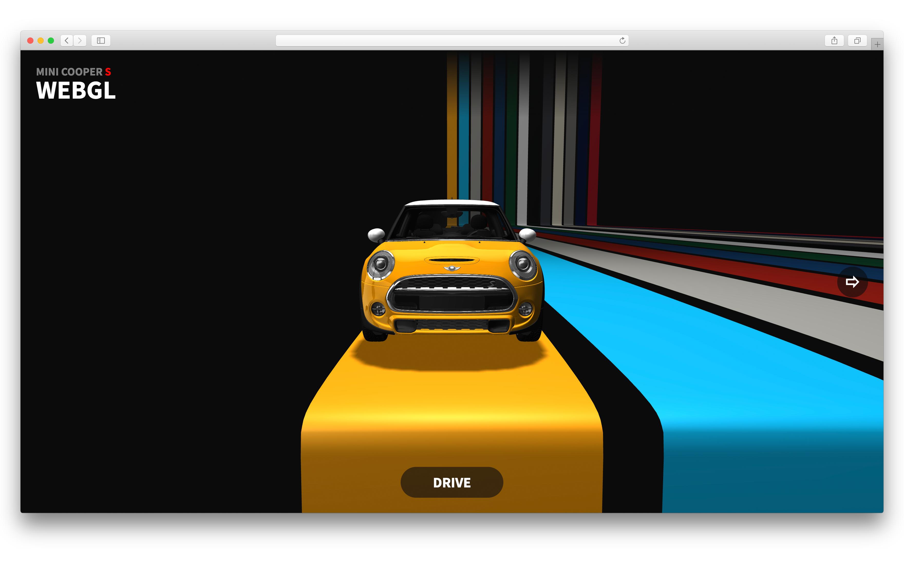
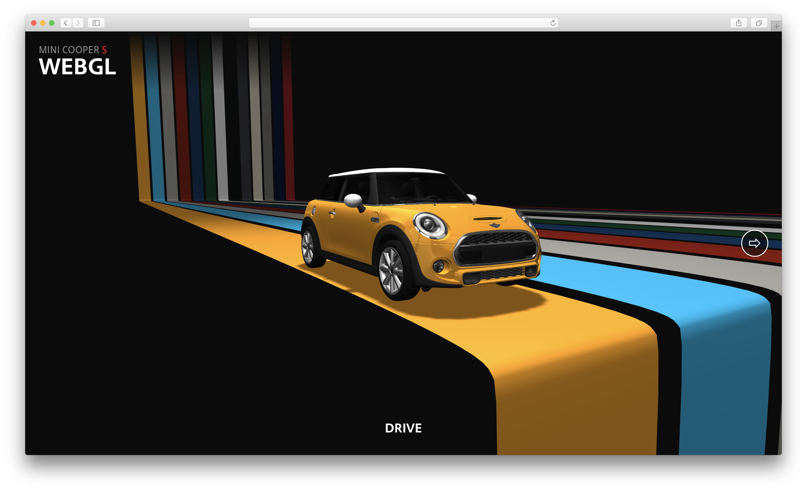
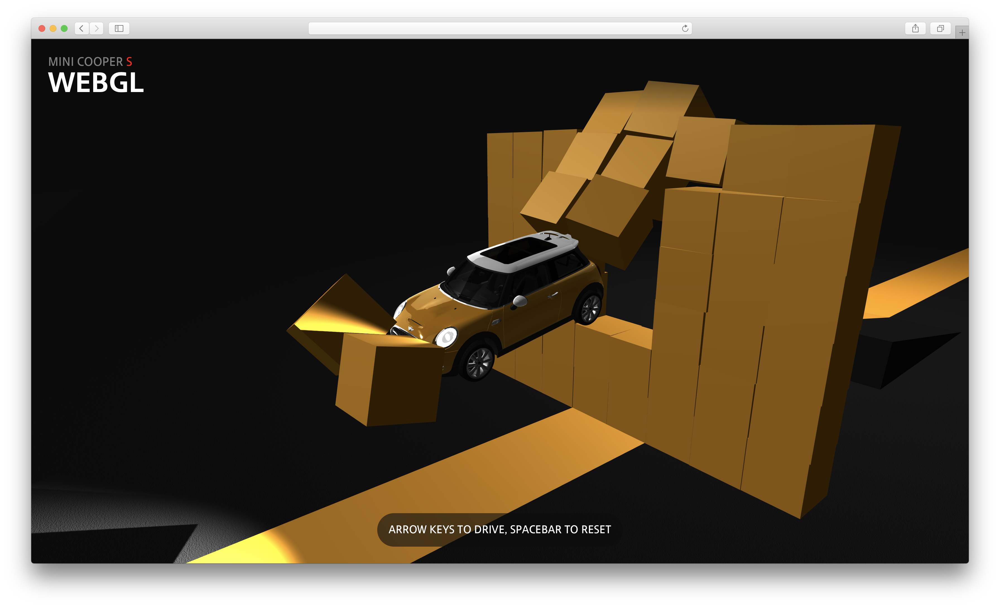
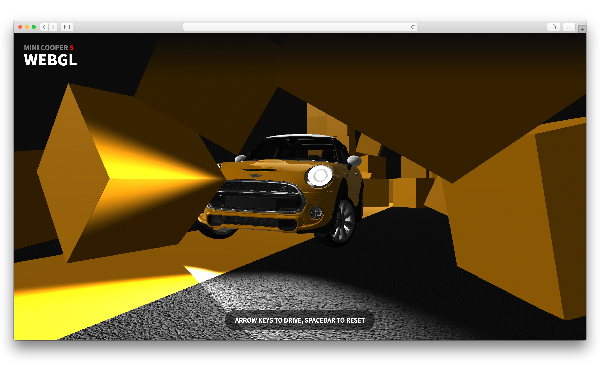
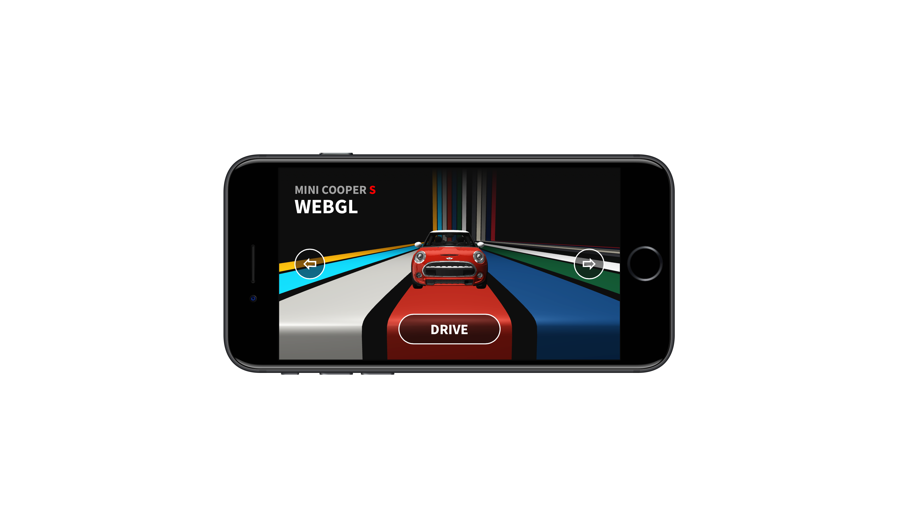
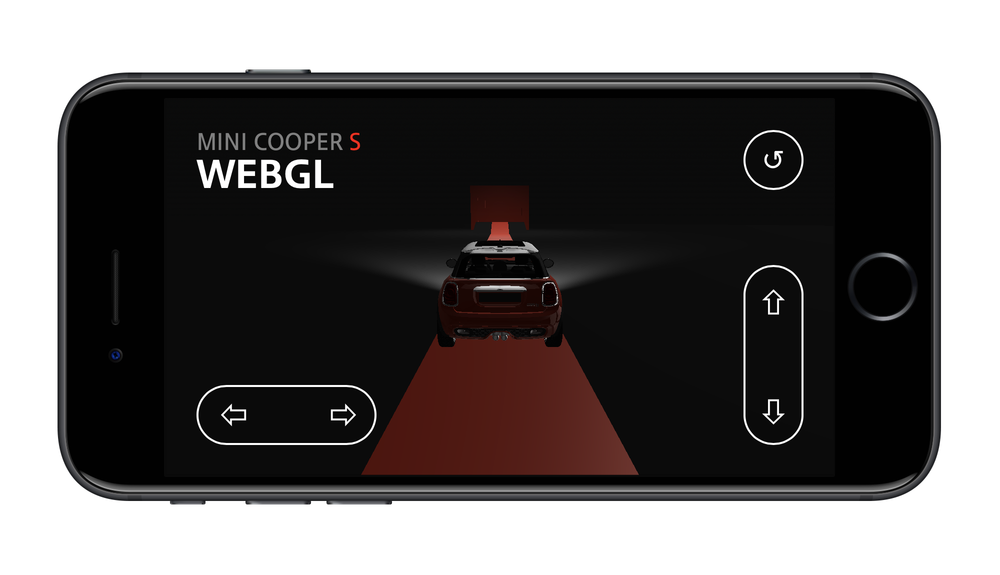
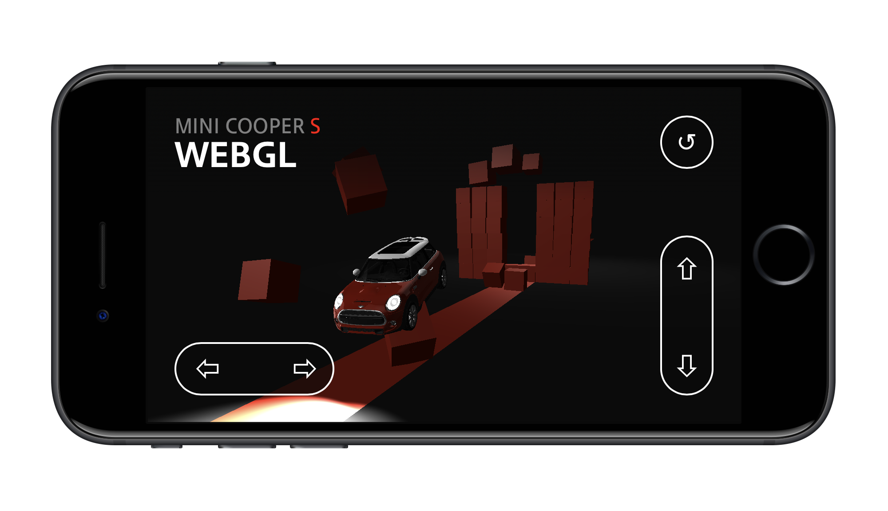

# WebGL demo of a MINI Cooper

A WebGL and Physics engine demo that allows you to jump a Mini Cooper straight through a wall of boxes.
Note that this is a personal project and is not directly related to [MINI](https://www.mini.co.uk).

Initially this project started out as a research project to learn WebGL: How to export models from [Blender](https://www.blender.org), import them in [Three.js](https://threejs.org), assign materials, create lights, etc. However, along the way I stumbled upon this fascinating [Ammo.js vehicle example](http://kripken.github.io/ammo.js/examples/webgl_demo_vehicle/index.html) and decided to use that as a base for this demo.

I also wanted this demo to work on an iPhone or iPad, so I've created two quality levels: 
**(1)** A low-quality mode that has no antialiasing, no shadows and uses a low-poly model. 
**(2)** A high-quality mode that has antialiasing, real-time shadows and a LOD model, that switches between low-poly and high-poly based on the distance to the camera. 
The mobile version automatically selects the low-quality mode and displays an overlay with touch controls, allowing you to drive the car around using your mobile as a gamepad. 

**Some technical details:**
- Model via [CG Trader](https://www.cgtrader.com)
- Written in [TypeScript](https://www.typescriptlang.org)
- WebGL via [Three.js](https://threejs.org)
- Physics via [Ammo.js](https://github.com/kripken/ammo.js)
- Build using [Webpack](https://webpack.github.io)

## Screenshots








## Demo
- https://mini.madebyferdi.com
- <kbd>↑</kbd> = Accelerate
- <kbd>↓</kbd> = Brake / reverse
- <kbd>←</kbd> = Steer left
- <kbd>→</kbd> = Steer right
- <kbd>p</kbd> = Pause physics engine
- <kbd>n</kbd> = Next step (when paused)
- <kbd>t</kbd> = Turbo mode
- <kbd>spacebar</kbd> = Reset car

## Requirements
- [NodeJS v8.5](https://nodejs.org)

## Libraries
- [Three.js](https://threejs.org)
- [Emscripten](http://kripken.github.io/emscripten-site)
- [Ammo.js](https://github.com/kripken/ammo.js)

## Run
```shell
npm run build:server
```
Server will run on [localhost](http://localhost:8080)

## Release
```shell
npm run release
```
